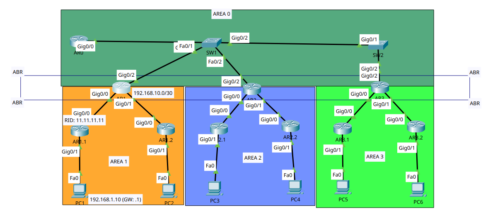

# Multi-Area OSPF Network Design, Implementation & Troubleshooting

## 1. Project Overview

This project demonstrates the design, configuration, verification, and troubleshooting of a hierarchical Multi-Area OSPF network in Cisco Packet Tracer. The network consists of one backbone area (Area 0) and three non-backbone areas interconnected through Area Border Routers (ABRs).

The project focuses on implementing dynamic routing across multiple OSPF areas, verifying successful route propagation using Cisco IOS commands, and troubleshooting real configuration issues that prevented full network convergence.

---
## 2. Objectives

- Design a hierarchical Multi-Area OSPF network.
- Configure OSPF across Area 0 and three non-backbone areas.
- Implement proper IPv4 addressing using /30 transit links and /24 LAN networks.
- Verify successful inter-area route propagation using Cisco IOS verification commands.
- Perform end-to-end connectivity testing between different OSPF areas.
- Diagnose and resolve routing issues through configuration auditing and routing table analysis.

---

## 3. Technologies Used

- Cisco Packet Tracer
- Cisco IOS CLI
- Open Shortest Path First (OSPF)
- Multi-Area OSPF
- IPv4 Addressing
- Area Border Routers (ABRs)
- Wildcard Masks
- Routing Table Verification
- ICMP Connectivity Testing

---

## 4. Network Topology



## Network Topology

The network is organized using a **multi-area OSPF** design consisting of one backbone area (**Area 0**) and three non-backbone areas.

- **Area 0 (Backbone):** Central transit network connecting all Area Border Routers (ABRs). All inter-area traffic traverses the backbone.
- **Area 1:** Connects two LANs (`192.168.1.0/24` and `192.168.2.0/24`) through ABR **AR1**.
- **Area 2:** Connects two LANs (`192.168.3.0/24` and `192.168.4.0/24`) through ABR **AR2**.
- **Area 3:** Connects two LANs (`192.168.5.0/24` and `192.168.6.0/24`) through ABR **AR3**.

Each non-backbone area contains two edge routers that provide gateway services for their respective LANs while exchanging routes with the backbone through their ABR.

(This project was inspired by the multi-area OSPF lab from **Jeremy's IT Lab (CCNA Course)**. While the overall hierarchical topology was used as a reference, the implementation and configuration were completed independently. I designed the IPv4 addressing scheme using **/30** transit networks and **/24** LAN networks, assigned unique Router IDs to every router, and configured passive interfaces on all host-facing gateways to suppress unnecessary OSPF Hello packets. During implementation, I independently diagnosed and resolved several configuration issues, including OSPF CLI syntax errors and an incorrect interface subnet mask that prevented proper route advertisement and full network convergence.)

---

## 5. Device Roles

| Device      | Role                                                                                         |
| ----------- | -------------------------------------------------------------------------------------------- |
| **AR0**     | Backbone Router responsible for interconnecting all OSPF areas through Area 0.               |
| **AR1**     | Area Border Router (ABR) connecting Area 1 to the Area 0 backbone.                           |
| **AR1.1**   | Internal Area 1 router serving as the default gateway for PC1.                               |
| **AR1.2**   | Internal Area 1 router serving as the default gateway for PC2.                               |
| **AR2**     | Area Border Router (ABR) connecting Area 2 to the Area 0 backbone.                           |
| **AR2.1**   | Internal Area 2 router serving as the default gateway for PC3.                               |
| **AR2.2**   | Internal Area 2 router serving as the default gateway for PC4.                               |
| **AR3**     | Area Border Router (ABR) connecting Area 3 to the Area 0 backbone.                           |
| **AR3.1**   | Internal Area 3 router serving as the default gateway for PC5.                               |
| **AR3.2**   | Internal Area 3 router serving as the default gateway for PC6.                               |
| **SW1**     | Layer 2 switch providing connectivity between AR0, AR1, and AR2 within the backbone network. |
| **SW2**     | Layer 2 switch providing connectivity between AR0 and AR3 within the backbone network.       |
| **PC1–PC6** | End-user devices used to verify inter-area routing and end-to-end network connectivity.      |

---

## 6. Network Design

OSPF was selected because it automatically discovers neighboring routers and exchanges routing information without requiring manually configured static routes.

All routers were placed in **Area 0**, the OSPF backbone area, allowing successful neighbor formation and route propagation.

---

# 7. Configuration Highlights

## Interface Configuration

The network was built using a hierarchical addressing scheme. Point-to-point transit links between routers were configured with **/30** subnet masks (`255.255.255.252`), while all LAN-facing gateway interfaces were assigned **/24** subnet masks (`255.255.255.0`) for end-user networks.

## OSPF Configuration

OSPF Process ID **1** was configured on every router. Network statements were added using the appropriate wildcard masks and Area IDs to advertise directly connected networks into their respective OSPF areas.

Example:

```cisco
router ospf 1
 network 10.0.0.0 0.0.0.255 area 0
 network 192.168.30.0 0.0.0.3 area 3
 network 192.168.5.0 0.0.0.255 area 3
```

Passive interfaces were configured on all LAN-facing interfaces to prevent unnecessary OSPF Hello packets from being transmitted to end devices.

---

# 8. Verification

## OSPF Routing Table Verification

The command below was used to verify successful inter-area route propagation from every OSPF area.

```cisco
show ip route ospf
```

Following remediation, AR0 successfully learned every remote LAN as an **OSPF Inter-Area (O IA)** route.

Example:

```text
O IA 192.168.1.0 [110/3] via 10.0.0.2
O IA 192.168.2.0 [110/3] via 10.0.0.2
O IA 192.168.3.0 [110/3] via 10.0.0.3
O IA 192.168.4.0 [110/3] via 10.0.0.3
O IA 192.168.5.0 [110/3] via 10.0.0.4
O IA 192.168.6.0 [110/3] via 10.0.0.4
```

### Route Interpretation

* **O IA** — OSPF Inter-Area route learned from another OSPF area.
* **110** — Administrative Distance (AD), representing the trust value assigned to routes learned through OSPF.
* **3** — OSPF Cost (Metric), representing the cumulative path cost from AR0 to the destination network.

The appearance of valid **O IA [110/3]** entries confirmed that Area 3 was correctly advertising its networks and that full OSPF convergence had been achieved.

---

## End-to-End Connectivity

Connectivity was validated by performing cross-area ping tests.

| Source | Destination | Result          |
| ------ | ----------- | --------------- |
| PC1    | PC5         | ✅ Success (5/5) |
| PC1    | PC6         | ✅ Success (5/5) |

---

# 9. Testing Performed

The following validation tests were completed after deployment:

* Verified successful OSPF route propagation across all four areas.
* Confirmed all remote LANs appeared in AR0's OSPF routing table.
* Verified Administrative Distance and OSPF Cost values for learned routes.
* Validated end-to-end connectivity between Area 1 and Area 3 hosts.
* Confirmed full OSPF convergence after configuration corrections.

---

# 10. Troubleshooting

## Problem

During post-deployment verification, AR0 failed to learn all Area 3 networks. One LAN network (`192.168.5.0/24`) was missing entirely, while another (`192.168.6.0`) appeared as an incorrect **/30** subnet rather than a valid OSPF Inter-Area route.

## Investigation

A routing table audit using `show ip route ospf` identified the missing and malformed routes. Configuration review across AR3, AR3.1, and AR3.2 revealed CLI syntax errors and an incorrect interface subnet mask.

## Root Cause

Two independent configuration issues prevented proper route advertisement:

* Invalid OSPF network statements caused by CLI formatting and syntax errors.
* A LAN interface configured with a **/30** subnet mask instead of the intended **/24**, causing OSPF to advertise an incorrect network prefix.

## Resolution

The incorrect OSPF network statements were corrected, the LAN interface on AR3.2 was reconfigured with the proper **/24** subnet mask, and the corresponding OSPF network statement was updated. After reconvergence, all expected **O IA [110/3]** routes appeared in the backbone routing table and end-to-end connectivity was successfully restored.

---

# 11. Key Concepts Demonstrated

* Hierarchical Multi-Area OSPF Design
* Area 0 Backbone Architecture
* Area Border Routers (ABRs)
* Inter-Area Route Advertisement
* OSPF Route Verification (`show ip route ospf`)
* Administrative Distance (AD)
* OSPF Cost (Metric)
* Wildcard Mask Configuration
* Interface Addressing and Subnet Mask Planning
* Passive Interface Configuration
* OSPF Troubleshooting Methodology
* Routing Table Analysis
* End-to-End Connectivity Validation

---


---

#### 12. Lessons Learned

This project strengthened my understanding of how Multi-Area OSPF exchanges routing information through Area Border Routers and how Area 0 serves as the backbone for inter-area communication. I also learned the importance of correct interface addressing, wildcard masks, and routing table verification when diagnosing routing issues.

The troubleshooting phase reinforced the value of using Cisco IOS verification commands such as `show ip route ospf` to identify configuration mistakes and confirm successful network convergence after remediation. While also able to read complicated text and turn it into a readable one in the CLI.

---

## 13. Future Improvements

While this project successfully demonstrates a hierarchical Multi-Area OSPF implementation, several enhancements could make the network more resilient and scalable:

- Implement OSPF route summarization between areas to reduce routing table size and improve scalability.
- Introduce redundant backbone links and tune OSPF costs to demonstrate path selection and automatic failover.
- Configure OSPF authentication to secure routing updates between neighboring routers.
- Perform packet analysis using Wireshark to observe OSPF Hello packets, Database Description (DBD), Link-State Advertisements (LSAs), and neighbor formation.
- Simulate link failures to observe OSPF convergence time and route recalculation.
- Expand the topology with additional areas or LAN segments to demonstrate scalability.
    

---

## 14. Decision Process ⭐

### Problem

As a network grows, manually configuring and maintaining static routes becomes increasingly difficult, error-prone, and time-consuming.

### Decision

Implement a hierarchical Multi-Area OSPF routing design.

### Reason

OSPF automatically discovers neighboring routers, exchanges routing information, calculates the best available paths, and adapts to topology changes without requiring manual route updates. Using multiple OSPF areas also improves scalability by reducing routing overhead and organizing larger networks into manageable sections.s, exchanges routing information, and updates routing tables when network topology changes.
