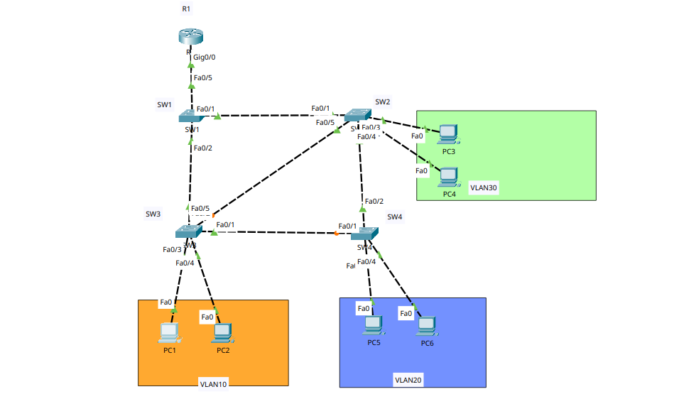

# PVST + - Layer 2 Isolation to ROAS Connectivity - Network Implementation & Troubleshooting Report

**Topology Scope:** 4 Switches (SW1–SW4), 6 End Hosts (PC1–PC6), and 1 Router (R1)

## 1. Executive Summary & Intent

The primary objective of this project was to construct a robust, redundant multi-switch network topology partitioned into three isolated subnets:

* **VLAN 10:** PC1, PC2 (`172.16.0.0/25` subnet)
* **VLAN 20:** PC5, PC6 (`172.16.0.128/25` subnet)
* **VLAN 30:** PC3, PC4 (`172.16.1.0/24` subnet)

To achieve redundancy without causing network loops, **IEEE 802.1Q trunk links** were configured between all switches (`SW1`–`SW4`), while Cisco's native **Per-VLAN Spanning Tree Plus (PVST+)** provided loop prevention. Inter-VLAN routing was subsequently established using a **Router-on-a-Stick (ROAS)** design.

---

## 2. Phase 1: Layer 2 Setup & PVST+ Loop Prevention

During the Layer 2 deployment, switches were interconnected in a full mesh grid.

### PVST+ Spanning Tree Behavior

Because standard switching loops cause catastrophic broadcast storms, Cisco **PVST+** automatically ran across the switches.

* PVST+ maintained an independent Spanning Tree instance for **each VLAN** (Instance 10, Instance 20, Instance 30).
* **Observation:** Ports `SW3 Fa0/5` and `SW4 Fa0/1` showed solid orange indicators.
* **Analysis:** This confirmed PVST+ was working correctly. To eliminate physical loops between `SW1`, `SW2`, `SW3`, and `SW4`, PVST+ automatically designated these redundant ports into an **Alternate/Blocking state (`BLK`)**.

---

## 3. The Layer 2 "Brick Wall" (Why Initial Pings Failed)

After setting up the switch ports, an immediate connectivity test was performed from **PC1 (VLAN 10)** to **PC3 (VLAN 30)**.

### Test Result:

```text
C:\> ping 172.16.1.10
Pinging 172.16.1.10 with 32 bytes of data:
Request timed out.
Request timed out.
Request timed out.
Request timed out.

Ping statistics for 172.16.1.10:
    Packets: Sent = 4, Received = 0, Lost = 4 (100% loss)

```

### Root Cause Analysis:

The failure was not due to bad cabling—it was **Layer 2 VLAN isolation working as intended**:

1. **Logical Separation:** Assigning PC1 to VLAN 10 and PC3 to VLAN 30 is the logical equivalent of plugging them into two separate physical switches in different rooms with no cable between them.
2. **Switch Forwarding Limits:** Switches forward frames purely by MAC address within the *same* VLAN tag. When a switch receives a frame tagged for VLAN 10, IEEE 802.1Q rules prevent it from sending that frame out of a port assigned to VLAN 30.
3. **Missing Gateway:** Switches cannot route traffic between IP subnets (`172.16.0.0/25` vs `172.16.1.0/24`). Traffic requires a Layer 3 routing device to cross VLAN boundaries.

---

## 4. Layer 2 Troubleshooting Log

During initial switch verification, one local misconfiguration was identified and corrected:

### 🚨 SW2 Port Misconfiguration (`Fa0/4`)

* **The Problem:** PC4 (VLAN 30) lost all connectivity and could not even ping PC3 on its own local VLAN.
* **Root Cause:** Interface `Fa0/4` on SW2 (connected to PC4) was accidentally configured as a **Trunk link** instead of an **Access link**. Standard end-host network interface cards (NICs) do not process 802.1Q tags, causing PC4 to drop all incoming frames.
* **The Resolution:**
```text
SW2(config)# interface FastEthernet0/4
SW2(config-if)# switchport mode access
SW2(config-if)# switchport access vlan 30

```


---

## 5. Phase 2: Router-on-a-Stick (ROAS) Upgrade & Troubleshooting

To allow controlled communication across the Layer 2 boundaries, Router **R1** was connected to **SW1 (`Fa0/5`)** via a single 802.1Q trunk link.

### 🚨 IP Subnet Overlap Error on R1

While configuring subinterfaces on R1, the router threw an error:

```text
Router(config-subif)# ip address 172.16.0.129 255.255.255.128
% 172.16.0.128 overlaps with GigabitEthernet0/0.10

```

* **Root Cause:** Subinterface `Gi0/0.10` was initially entered with a `/24` mask (`255.255.255.0`) instead of a `/25` mask (`255.255.255.128`). The `/24` mask claimed the entire IP space from `172.16.0.0` to `172.16.0.255`, overlapping with VLAN 20's target gateway (`172.16.0.129`).
* **The Resolution:** Reconfigured `Gi0/0.10` with the correct `/25` mask (`255.255.255.128`) to properly divide the `172.16.0.0` block into two distinct `/25` subnets.

### Final Corrected Router Configuration (R1)

```text
enable
configure terminal
hostname R1

! Subinterface for VLAN 10 Gateway
interface GigabitEthernet0/0.10
 encapsulation dot1Q 10
 ip address 172.16.0.1 255.255.255.128
 no shutdown

! Subinterface for VLAN 20 Gateway
interface GigabitEthernet0/0.20
 encapsulation dot1Q 20
 ip address 172.16.0.129 255.255.255.128
 no shutdown

! Subinterface for VLAN 30 Gateway
interface GigabitEthernet0/0.30
 encapsulation dot1Q 30
 ip address 172.16.1.1 255.255.255.0
 no shutdown

! Physical Parent Interface Activation
interface GigabitEthernet0/0
 no shutdown
exit
end
write memory

```

---

## 6. Final Verification & Breakthrough

After configuring the Default Gateway addresses on all 6 PCs (`172.16.0.1`, `172.16.0.129`, and `172.16.1.1`), cross-VLAN communication was re-tested from **PC1** to **PC3**.

### Attempt 1: Initial Cross-VLAN Test

```text
C:\> ping 172.16.1.10

Request timed out.
Reply from 172.16.1.10: bytes=32 time<1ms TTL=127
Reply from 172.16.1.10: bytes=32 time=10ms TTL=127
Reply from 172.16.1.10: bytes=32 time<1ms TTL=127

Packets: Sent = 4, Received = 3, Lost = 1 (25% loss)

```

> **ARP Delay Explanation:** The initial single packet drop was caused by standard **Address Resolution Protocol (ARP)** processing. Router R1 knew PC3's IP address, but had to temporarily pause packet forwarding to broadcast an ARP request and learn PC3's destination MAC address.

### Attempt 2: Follow-up Verification Test

```text
C:\> ping 172.16.1.10

Reply from 172.16.1.10: bytes=32 time=1ms TTL=127
Reply from 172.16.1.10: bytes=32 time<1ms TTL=127
Reply from 172.16.1.10: bytes=32 time=29ms TTL=127
Reply from 172.16.1.10: bytes=32 time<1ms TTL=127

Ping statistics for 172.16.1.10:
    Packets: Sent = 4, Received = 4, Lost = 0 (0% loss)

```

* **Result:** **100% Operational.** With MAC addresses cached in the ARP table, inter-VLAN routing functioned flawlessly across subnets.

---

## 7. Comparative Feature Summary

| Feature / Metric | Phase 1 (Layer 2 Only) | Phase 2 (ROAS Integrated) |
| --- | --- | --- |
| **Intra-VLAN Pings (PC1 $\rightarrow$ PC2)** | ✅ Working | ✅ Working |
| **Inter-VLAN Pings (PC1 $\rightarrow$ PC3)** | ❌ Blocked by VLAN Boundaries | ✅ Routed via Subinterfaces |
| **Spanning Tree Protocol** | PVST+ (Active instance per VLAN) | PVST+ (Active instance per VLAN) |
| **Loop State** | Secondary links in `BLK` state | Secondary links in `BLK` state |
| **Default Gateways** | Unconfigured | Subinterface IPs (`.1`, `.129`, `.1`) |
| **802.1Q Trunking** | Active between SW1–SW4 | Active between SW1–SW4 & SW1–R1 |
| **Switch Port Status** | Access & Trunk ports configured     | Access & Trunk ports configured     |
| **Default Gateways**   | None configured on PCs              | Configured to Router Subinterfaces  |
| **Routing Mechanism**  | None                                | 802.1Q Tagged Subinterfaces         |
